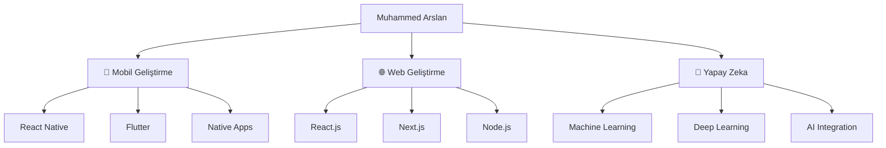

# 👋 Merhaba, Ben Muhammed Arslan

<div align="center">
  
[](https://git.io/typing-svg)

</div>

<div align="center">
  

[](https://github.com/MuhammedArslan46)

</div>

---

## 💫 Hakkımda

```javascript
const muhammedArslan = {
    fullName: "Muhammed Arslan",
    title: "Full-Stack Developer & Mobile App Developer",
    location: "Türkiye 🇹🇷",
    expertise: {
        mobile: ["React Native", "Flutter", "iOS", "Android"],
        web: ["React.js", "Next.js", "Node.js", "TypeScript"],
        ai: ["Machine Learning", "Deep Learning", "TensorFlow", "Python"],
        backend: ["Node.js", "Express.js", "MongoDB", "PostgreSQL"],
        tools: ["Git", "Docker", "AWS", "Firebase"]
    },
    currentFocus: "Yapay zeka destekli mobil ve web uygulamaları",
    passion: "Teknoloji ile hayatı kolaylaştırmak",
    
    sayHello: () => {
        return "Merhaba! Hayal ettiğiniz projeyi gerçeğe dönüştürelim! 🚀";
    }
};
```

---

## 🚀 Uzmanlık Alanlarım

<div align="center">

### 📱 Mobil Geliştirme


### 🌐 Web Geliştirme


### 🤖 Yapay Zeka & ML


</div>

---

## 📊 GitHub İstatistiklerim

<div align="center">
  


</div>

---

## 🏆 GitHub Trofylerim

<div align="center">
  
[](https://github.com/MuhammedArslan46)

</div>

---

## 🔥 Çalışma Alanlarım



---

## 💡 Projelerim

<div align="center">

### 🎯 Odak Alanlarım
- 📱 **Mobil Uygulama Geliştirme**: iOS ve Android platformları için native ve cross-platform uygulamalar
- 🌐 **Web Geliştirme**: Modern web teknolojileri ile responsive ve performanslı uygulamalar  
- 🤖 **Yapay Zeka**: ML/DL modelleri geliştirme ve web/mobil uygulamalara entegrasyon
- 🔧 **Full-Stack Çözümler**: End-to-end uygulama geliştirme

</div>

---

## 📈 Geliştirme Aktivitem

<div align="center">
  
[](https://github.com/MuhammedArslan46)

</div>

---

## 🌟 Yeteneklerim

<div align="center">

| **Kategori** | **Teknolojiler** | **Seviye** |
|:---:|:---:|:---:|
| **📱 Mobil** | React Native, Flutter, iOS, Android | ⭐⭐⭐⭐⭐ |
| **🌐 Frontend** | React, Next.js, TypeScript, HTML/CSS | ⭐⭐⭐⭐⭐ |
| **⚙️ Backend** | Node.js, Express, MongoDB, PostgreSQL | ⭐⭐⭐⭐⭐ |
| **🤖 AI/ML** | Python, TensorFlow, PyTorch, Scikit-learn | ⭐⭐⭐⭐⭐ |
| **☁️ Cloud** | AWS, Firebase, Docker, Git | ⭐⭐⭐⭐⭐ |

</div>

---

## 🎯 2024 Hedeflerim

- 🚀 5+ yenilikçi mobil uygulama geliştirmek
- 🤖 AI entegreli web uygulamaları oluşturmak
- 📚 Machine Learning ve Deep Learning alanında uzmanlaşmak
- 🌐 Open source projelere katkıda bulunmak
- 📈 Teknoloji topluluğunda aktif rol almak

---

## 📫 Bana Ulaşın

<div align="center">

[](https://www.linkedin.com/in/muhammed-arslan-517574233?utm_source=share&utm_campaign=share_via&utm_content=profile&utm_medium=ios_app )
[](https://twitter.com/Muhammetarsln46)
[](mailto:46mht123@gmail.com)


</div>

---

<div align="center">
  
### 💭 "Kod yazmak sanat, problem çözmek tutku, teknoloji ile hayatları değiştirmek ise misyon."


**Hayal ettiğiniz projeyi birlikte gerçeğe dönüştürelim! 🚀**

</div>

---

<div align="center">
  


</div>
