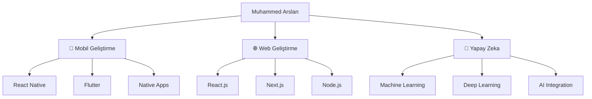

# 👋 Merhaba, Ben Muhammed Arslan

  

  

---

## 💫 Hakkımda

  

 

  
| 👨‍💻 **Kişisel Bilgiler** | 🚀 **Uzmanlık Alanları** |
|:---|:---|
| 🎓 **Eğitim:** Bilgisayar Mühendisliği | 📱 **Mobil Geliştirme** - iOS & Android |
| 🌍 **Konum:** Türkiye 🇹🇷 | 🌐 **Web Geliştirme** - Full Stack |
| 💼 **Durum:** Aktif Geliştirici | 🤖 **Yapay Zeka** - ML & Computer Vision |
| 🎯 **Odak:** Yenilikçi Çözümler | 🔧 **Proje Yönetimi** - End-to-end |

 

  
### 🚀 **Geliştirmiş Olduğum Projeler**

**🎯 Odaklandığım Ana Alanlar:**

<table>
<tr>
<td align="center" width="33%">
 
<strong>📱 MOBİL UYGULAMA</strong> 
<em>Cross-platform çözümler</em> 
<em>Native performans</em>
</td>
<td align="center" width="33%">
 
<strong>🌐 WEB GELİŞTİRME</strong> 
<em>Modern web teknolojileri</em> 
<em>Responsive tasarım</em>
</td>
<td align="center" width="33%">
 
<strong>🤖 YAPAY ZEKA</strong> 
<em>Görüntü işleme</em> 
<em>Makine öğrenmesi</em>
</td>
</tr>
</table>

 

  

**"Teknoloji ile hayatları dönüştürmeye odaklanıyorum"** 💡

---

## 🚀 Uzmanlık Alanlarım

### 📱 Mobil Geliştirme

  

### 🌐 Web Geliştirme

  

### 🤖 Yapay Zeka & Makine Öğrenmesi

  

### 🛠️ Araçlar & Teknolojiler  

  

---

## 📊 GitHub İstatistiklerim

  

  

---

## 🏆 GitHub Trofylerim

---

## 🔥 Çalışma Alanlarım

---

## 💡 Projelerim

### 🎯 Odak Alanlarım
- 📱 **Mobil Uygulama Geliştirme**: iOS ve Android platformları için native ve cross-platform uygulamalar
- 🌐 **Web Geliştirme**: Modern web teknolojileri ile responsive ve performanslı uygulamalar  
- 🤖 **Yapay Zeka**: ML/DL modelleri geliştirme ve web/mobil uygulamalara entegrasyon
- 🔧 **Full-Stack Çözümler**: End-to-end uygulama geliştirme

---

## 📈 Geliştirme Aktivitem

---

## 🌟 Yeteneklerim

| **Kategori** | **Teknolojiler** | **Seviye** |
|:---:|:---:|:---:|
| **📱 Mobil** | React Native, Flutter, iOS, Android | ⭐⭐⭐⭐⭐ |
| **🌐 Frontend** | React, Next.js, TypeScript, HTML/CSS | ⭐⭐⭐⭐⭐ |
| **⚙️ Backend** | Node.js, Express, MongoDB, PostgreSQL | ⭐⭐⭐⭐⭐ |
| **🤖 AI/ML** | Python, TensorFlow, PyTorch, OpenCV | ⭐⭐⭐⭐⭐ |
| **☁️ Cloud** | AWS, Firebase, Docker, Git | ⭐⭐⭐⭐⭐ |

---

## 🎯 2025 Hedeflerim

- 🚀 5+ yenilikçi mobil uygulama geliştirmek
- 🤖 AI entegreli web uygulamaları oluşturmak
- 📚 Machine Learning ve Deep Learning alanında uzmanlaşmak
- 🌐 Open source projelere katkıda bulunmak
- 📈 Teknoloji topluluğunda aktif rol almak

---

## 📫 Bana Ulaşın

---

  
### 💭 "Kod yazmak sanat, problem çözmek tutku, teknoloji ile hayatları değiştirmek ise misyon."

**Hayal ettiğiniz projeyi birlikte gerçeğe dönüştürelim! 🚀**

---

